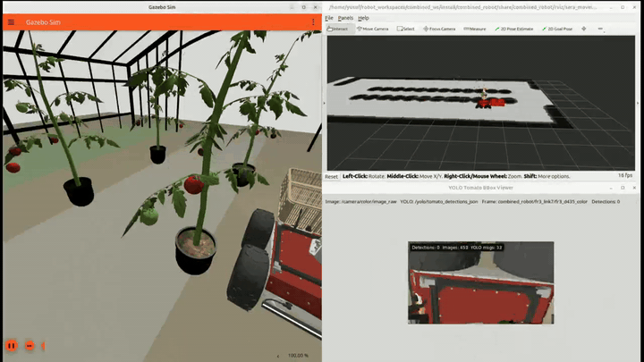

# Panther-FR3 Greenhouse Tomato Harvesting Simulation

Autonomous greenhouse harvesting simulation built on ROS 2 Jazzy, Gazebo
Harmonic, Nav2, MoveIt 2, Pilz LIN motion, RGB-D perception, YOLO tomato
detection, and a combined Husarion Panther + Franka FR3 mobile manipulator.

The system navigates a simulated tomato greenhouse, detects tomatoes from the
hand-mounted RGB-D camera, maps detections into the robot/world frame, mirrors
tomatoes into the MoveIt planning scene, selects harvest targets, picks them
with a contact-triggered gripper attachment, and drops ripe/rotten tomatoes into
separate baskets.

## Demo Video

[](https://www.youtube.com/watch?v=mCIoyJSAJ8w&t=79s)

## Highlights

- Combined Panther UGV + Franka FR3 robot model.
- Gazebo greenhouse world with B/C tomato rows and per-fruit Gazebo models.
- RGB-D camera mounted on the FR3 hand.
- YOLO detector with live bounding-box viewer.
- Tomato 3D map topic and optional GUI panel.
- Tomato collision objects in RViz/MoveIt.
- Nav2 autonomous route execution through the greenhouse.
- Mission manager state machine for survey and harvest phases.
- OMPL approach planning and Pilz LIN straight-line pick motion.
- Contact-triggered fixed-joint attachment for stable tomato transport.
- Separate good and bad baskets for ripe and rotten tomatoes.

## Tested Environment

| Component | Version |
| --- | --- |
| OS | Ubuntu 24.04 |
| ROS 2 | Jazzy |
| Simulator | Gazebo Harmonic / `gz sim` 8 |
| Planning | MoveIt 2, OMPL, Pilz Industrial Motion Planner |
| Navigation | Nav2, AMCL, SLAM Toolbox |
| Perception | Ultralytics YOLO + RGB-D camera |

## Repository Layout

```text
robot_workspaces/
|-- husarion_ws/                  # Husarion Panther description, Gazebo, control
|-- franka_ros2_ws/               # Franka ROS 2 description packages
`-- combined_ws/
    |-- src/
    |   |-- combined_robot/        # Main simulation, mission, perception, picking
    |   `-- combined_robot_gz_plugins/
    |-- yolo_models/tomato/        # YOLO weights and training outputs
    `-- disable_fastdds_shm.xml    # DDS profile used for stable local simulation
```

Important `combined_robot` directories:

```text
combined_ws/src/combined_robot/
|-- combined_robot/               # Python ROS 2 nodes
|-- config/                       # Nav2, waypoints, FR3 poses, controllers
|-- launch/                       # Gazebo, RViz, mission, demo launches
|-- maps/                         # Greenhouse map files
|-- models/                       # Gazebo model assets
|-- rviz/                         # RViz configurations
|-- urdf/                         # Combined robot Xacro/URDF
`-- worlds/                       # Greenhouse SDF worlds
```

## Core ROS 2 Nodes

| Node | Role |
| --- | --- |
| `mission_manager` | Executes survey/harvest route, selects targets, launches pick pipeline |
| `yolo_tomato_detector` | Runs YOLO inference on `/camera/color/image_raw` |
| `tomato_depth_mapper` | Converts detections into 3D tomato records |
| `tomato_collision_scene_manager` | Publishes tomato RViz markers and MoveIt collision objects |
| `greenhouse_nearest_pick_place` | Performs approach, LIN pick, attach, retreat, basket drop |
| `yolo_bbox_viewer` | Displays live YOLO detections |
| `tomato_map_panel` | Optional live tomato table GUI |
| `greenhouse_planning_scene` | Adds static greenhouse/robot environment collision objects |

## Install Dependencies

Install ROS 2 Jazzy first, then install the project dependencies:

```bash
sudo apt update
sudo apt install -y \
  python3-colcon-common-extensions \
  python3-rosdep2 \
  python3-numpy \
  python3-scipy \
  python3-yaml \
  python3-tk \
  ros-jazzy-ros-gz \
  ros-jazzy-gz-ros2-control \
  ros-jazzy-ros2-control \
  ros-jazzy-ros2-controllers \
  ros-jazzy-navigation2 \
  ros-jazzy-nav2-bringup \
  ros-jazzy-slam-toolbox \
  ros-jazzy-robot-localization \
  ros-jazzy-moveit \
  ros-jazzy-moveit-ros-visualization \
  ros-jazzy-pilz-industrial-motion-planner
```

Initialize rosdep if needed:

```bash
sudo rosdep init 2>/dev/null || true
rosdep update
```

Install package dependencies from the three workspaces:

```bash
cd ~/robot_workspaces
rosdep install \
  --from-paths husarion_ws/src franka_ros2_ws/src combined_ws/src \
  --ignore-src -r -y \
  --skip-keys "ament_python libfranka olv_module_descriptions franka_gazebo_bringup"
```

Some Franka hardware-only dependencies may not resolve on every machine. The
simulation primarily requires `franka_description`.

## YOLO Environment

The default launch file expects the trained tomato model here:

```text
~/robot_workspaces/combined_ws/yolo_models/tomato/best.pt
```

It also expects an Ultralytics/PyTorch environment at:

```text
~/yolo_env/lib/python3.12/site-packages
```

Example setup:

```bash
python3 -m venv ~/yolo_env
source ~/yolo_env/bin/activate
pip install --upgrade pip
pip install ultralytics opencv-python
```

Install the PyTorch build that matches your GPU/CUDA setup from the official
PyTorch instructions. If CUDA is not available, run YOLO with `yolo_device:=cpu`.

## Build

Build the workspaces in this order:

```bash
source /opt/ros/jazzy/setup.bash

cd ~/robot_workspaces/husarion_ws
colcon build --symlink-install
source install/setup.bash

cd ~/robot_workspaces/franka_ros2_ws
colcon build --symlink-install --packages-select franka_description
source install/setup.bash

cd ~/robot_workspaces/combined_ws
colcon build --symlink-install
source install/setup.bash
```

For every new terminal:

```bash
source /opt/ros/jazzy/setup.bash
source ~/robot_workspaces/husarion_ws/install/setup.bash
source ~/robot_workspaces/franka_ros2_ws/install/setup.bash
source ~/robot_workspaces/combined_ws/install/setup.bash
export FASTRTPS_DEFAULT_PROFILES_FILE=~/robot_workspaces/combined_ws/disable_fastdds_shm.xml
export RMW_FASTRTPS_USE_QOS_FROM_XML=1
```

## Launch Options

### 1. Greenhouse + Robot Only

Use this when checking Gazebo, controllers, robot model, and the greenhouse
world:

```bash
ros2 launch combined_robot combined_gazebo_sera.launch.py
```

### 2. Full Survey-Harvest Demo

This launch starts Gazebo, RViz, YOLO, tomato mapping, collision scene, Nav2,
MoveIt, and the mission manager.

```bash
ros2 launch combined_robot sera_spawn_harvest_demo.launch.py \
  mission_autostart:=true \
  route_name:=full_survey_then_pick_front_only \
  mission_mode:=survey_harvest \
  yolo_device:=cuda:0 \
  run_rviz:=true \
  run_gazebo_gui_client:=true \
  run_yolo_bbox_viewer:=true \
  run_tomato_map_panel:=false \
  harvest_pick_max_attempts:=0 \
  harvest_pick_max_per_waypoint:=0
```

If your username or checkout path is different from the original development
machine, pass explicit YOLO paths:

```bash
ros2 launch combined_robot sera_spawn_harvest_demo.launch.py \
  mission_autostart:=true \
  yolo_model_path:=$HOME/robot_workspaces/combined_ws/yolo_models/tomato/best.pt \
  yolo_site_packages:=$HOME/yolo_env/lib/python3.12/site-packages
```

### 3. CPU-Friendly Demo

```bash
ros2 launch combined_robot sera_spawn_harvest_demo.launch.py \
  mission_autostart:=true \
  yolo_device:=cpu \
  run_rviz:=false \
  run_yolo_bbox_viewer:=false \
  run_tomato_map_panel:=false
```

## Useful Topics

| Topic | Type / Format | Purpose |
| --- | --- | --- |
| `/camera/color/image_raw` | `sensor_msgs/Image` | RGB stream for YOLO |
| `/camera/depth/image_raw` | `sensor_msgs/Image` | Depth stream for 3D mapping |
| `/yolo/tomato_detections_json` | JSON string | YOLO detection output |
| `/tomato_map/list` | JSON string | Merged 3D tomato inventory |
| `/tomato_collision_scene/markers` | `MarkerArray` | RViz tomato markers |
| `/planning_scene` | `PlanningScene` | MoveIt collision scene updates |
| `/tomato_harvest/target_selection` | JSON string | Active harvest target |
| `/tomato_harvest/picked` | JSON string | Completed harvest event |
| `/mission_pick/tomato_center` | `PointStamped` | Selected tomato center in `fr3_link0` |

## Harvest Classes

The demo uses semantic classes from YOLO/model names:

| Class group | Behavior |
| --- | --- |
| `fully_ripened`, `ripe` | Harvest target, dropped into the good basket |
| `rotten`, `disease`, `diseased`, `bad` | Harvest target, dropped into the bad basket |
| `green`, `unripe` | Rejected as harvest target, still useful as collision context |

## Latest Demo Metrics

The latest full greenhouse demo run produced:

| Metric | Value |
| --- | ---: |
| Pick attempts | 24 |
| Successful picks | 19 |
| Failed picks | 5 |
| Pick success rate | 79.2% |
| Good basket tomatoes | 12 |
| Bad basket tomatoes | 7 |
| B-row pick success | 11 / 14 = 78.6% |
| C-row pick success | 8 / 10 = 80.0% |

The final demo world contains 59 tomato models:

| Group | Count |
| --- | ---: |
| Fully ripened | 24 |
| Green / unripe | 23 |
| Rotten | 12 |

## Troubleshooting

### Gazebo opens but the world is blank

Wait a few seconds for assets and controllers to load. If it stays blank,
restart Gazebo and verify that the `combined_robot` package was built and
sourced:

```bash
source ~/robot_workspaces/combined_ws/install/setup.bash
ros2 pkg prefix combined_robot
```

### Controllers are inactive

Check controller state:

```bash
ros2 control list_controllers
```

Expected active controllers include:

```text
fr3_arm_controller
fr3_gripper_controller
drive_controller
joint_state_broadcaster
```

### YOLO does not start

Check the model and Python package paths:

```bash
ls ~/robot_workspaces/combined_ws/yolo_models/tomato/best.pt
source ~/yolo_env/bin/activate
python3 -c "import ultralytics, torch; print(torch.cuda.is_available())"
```

If CUDA is unavailable, use `yolo_device:=cpu`.

### RViz tomato objects do not appear

Enable the collision scene manager and markers:

```bash
run_tomato_collision_scene:=true \
tomato_collision_publish_planning_scene:=true \
tomato_collision_publish_markers:=true
```

Then add `/tomato_collision_scene/markers` as a `MarkerArray` display in RViz.

### Robot hesitates after a pick

This usually happens while the mission manager waits for fresh YOLO/depth
detections, updates the tomato inventory, or retries a reachable grasp
candidate. It is expected during long full-greenhouse demos.

## Development Notes

- `sera_waypoints.yaml` defines survey and harvest routes.
- `fr3_observation_poses.yaml` defines camera/arm scan and pick-front poses.
- `greenhouse_nearest_pick_place.py` contains the pick-place pipeline.
- `mission_manager.py` owns route execution and harvest target selection.
- `tomato_depth_mapper.py` merges YOLO detections with Gazebo model centers for
  stable simulated picking.
- `tomato_collision_scene_manager.py` mirrors tomato records into MoveIt.

## License

The `combined_robot` package is declared as Apache-2.0 in `package.xml`.
